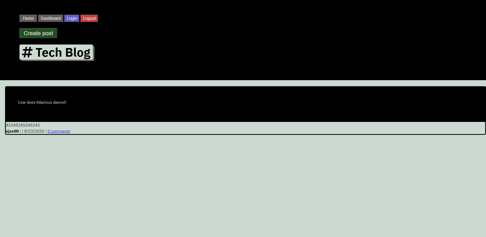

    
    
    
    
    
    

# Tech Blog

  ## Table of Contents
  * [Description](#description)
  * [Installation Instructions](#installation-instructions)
  * [Usage](#usage)
  * [Contribution Guidelines](#contribution-guidelines)
  
  ## Description
  This application stores your favorite and most important notes!
    

  ## Installation Instructions
  Download the application from the GitHub repository here: https://github.com/geocode-matt/Tech-Blog.

  ## Usage
  If you prefer to run the application on your own machine, download the application (above) and initialize by using the 'npm start' command in the command line. Either deploy through Heroku and type 'heroku open' in command line, or visit 'localhost:3001' in your favorite browser to view the application.

  If you would rather just use the application remotely visit the deployed application on Heroku:
        https://enigmatic-harbor-47542.herokuapp.com/

  ## Contribution Guidelines
  Please email the project owner (mlindenx@email.com) for contribution information. 

  ## Questions
  Please send any questions/concerns/comments to: mlindenx@gmail.com